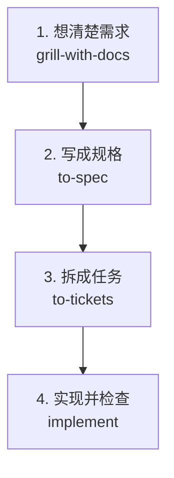

# Skills 使用指南

本指南面向使用本项目的开发者，说明如何选择和调用仓库中的技能。当前安装 **35 个技能**：**14 个允许自动匹配，21 个仅显式调用**。不包含个人目录或插件提供的技能。

## 快速开始

把技能名和任务一起发到 AI 代理的聊天输入框，以下示例不是终端命令：

```text
$ask-matt 我想新增一个功能，帮我选择合适的工作流程。

$diagnosing-bugs 排查登录测试间歇性失败，复现命令是 npm test。

$code-review 审查当前分支相对 main 的改动，需求见 Issue #42。
```

示例中的分支、Issue 编号、文件名和命令均需替换为实际值。审查基线可以是仓库主分支、其他分支、标签或提交 SHA。

一个容易执行的请求通常包含：**技能名＋目标＋范围或输入材料＋期望结果**。例如：

```text
$research 调研支付服务的幂等性设计，限定官方文档和源码，
将方案比较与引用保存为一份 Markdown 报告。
```

## 调用方式

| 表中标记 | 含义 | 使用方法 |
| --- | --- | --- |
| 自动＋用户 | 代理可根据任务描述自行选择；用户也可明确指定 | 直接描述任务，或输入 `$技能名 任务描述` |
| 仅用户 | 关闭隐式匹配，需要显式指定该技能 | 输入 `$技能名 任务描述`，或明确说“使用某技能……” |

自动匹配表示允许选择，不保证每次都会触发。需要确定使用某个技能时，显式点名。

Codex 的 `$技能名` 用法和调用策略见 [官方技能文档](https://learn.chatgpt.com/docs/build-skills)。不同客户端的技能选择入口可能不同；若选择器中未显示某个技能，可以直接要求代理读取其 `SKILL.md` 并按其执行。

本仓库部分技能正文沿用 `/技能名` 或 `Skill tool` 表述，它们表示调用相应技能的意图；执行时使用当前代理支持的技能加载方式。含后台代理、命令行或外部服务操作的技能，也需要运行环境支持相应能力。

## 整体使用流程

开发一个新功能，先记住这四步：



| 步骤 | 直接发送 | 完成标志 |
| --- | --- | --- |
| 1. 想清楚 | `$grill-with-docs 我想做一个搜索功能，帮我明确需求` | 你和代理对功能范围、验收条件达成一致 |
| 2. 写规格 | `$to-spec 把刚才确认的需求整理成规格` | 得到规格 Issue |
| 3. 拆任务 | `$to-tickets 把这份规格拆成实施工单` | 得到有先后依赖的工单 |
| 4. 做出来 | `$implement 实现工单 #实际编号` | 当前工单实现、测试和审查完成，再做下一张可执行工单 |

每完成一步，再发送下一步。`implement` 已包含测试和代码审查；工单全部完成后，对照规格验收，再按需要和授权完成推送、PR 或合并。

**可以跳步：**需求明确的小改动直接用 `implement`；已有规格从第 3 步开始；已有可执行工单从第 4 步开始。

其他情况只记住几个入口：

- **不知道用哪个**：`$ask-matt 描述你当前的情况`。
- **排查复杂 Bug**：`$diagnosing-bugs 描述现象和复现方式`。
- **只想审查代码**：`$code-review 审查相对某个分支或提交的改动`。
- **大型项目还没理清方向**：先用 `wayfinder`，方向明确后回到第 2 步。
- **查资料或试方案**：按需使用 `research` 或 `prototype`，把结论带回当前步骤。

其他技能在下面的目录中按需查找，无需逐个执行。

## 技能目录

点击名称可查看实际执行说明。表中的“作用与产出”描述技能工作流；涉及提交、推送、发布或合并时，仍按当前任务授权和项目规范执行。

### 需求澄清与规划（10 个）

| 名称 | 调用方式 | 作用与产出 | 使用示例 |
| --- | --- | --- | --- |
| [ask-matt](../.agents/skills/ask-matt/SKILL.md) | 仅用户 | 技能导航：根据当前情况选择技能和流程 | `$ask-matt 我有个功能想法，应该从哪开始？` |
| [grilling](../.agents/skills/grilling/SKILL.md) | 自动＋用户 | 多轮追问目标、约束和决策，是多个访谈技能的基础 | `$grilling 审视这个权限方案，找出遗漏` |
| [grill-me](../.agents/skills/grill-me/SKILL.md) | 仅用户 | 访谈澄清计划或设计，不保存领域文档 | `$grill-me 帮我梳理这个产品想法` |
| [grill-with-docs](../.agents/skills/grill-with-docs/SKILL.md) | 仅用户 | 访谈同时记录领域术语和架构决策 | `$grill-with-docs 设计权限系统并记录决策` |
| [domain-modeling](../.agents/skills/domain-modeling/SKILL.md) | 自动＋用户 | 明确领域概念，维护 CONTEXT.md 和 ADR | `$domain-modeling 明确账号、用户和租户的区别` |
| [wayfinder](../.agents/skills/wayfinder/SKILL.md) | 仅用户 | 将大型模糊项目组织为决策地图，逐项消除不确定性 | `$wayfinder 规划旧系统迁移，先厘清关键决策` |
| [to-questionnaire](../.agents/skills/to-questionnaire/SKILL.md) | 仅用户 | 为需要他人补充的信息生成问卷 | `$to-questionnaire 整理需要业务方回答的结算问题` |
| [research](../.agents/skills/research/SKILL.md) | 自动＋用户 | 派后台代理查阅一手资料，生成带引用的 Markdown 报告 | `$research 调研 PostgreSQL 多租户隔离方案` |
| [to-spec](../.agents/skills/to-spec/SKILL.md) | 仅用户 | 将已有讨论综合成规格，发布到项目 Issue 跟踪器 | `$to-spec 将刚才的讨论整理成规格` |
| [to-tickets](../.agents/skills/to-tickets/SKILL.md) | 仅用户 | 将规格拆成端到端小工单，明确阻塞关系并发布 | `$to-tickets 将规格 #42 拆成实施工单` |

### 实现、诊断与审查（7 个）

| 名称 | 调用方式 | 作用与产出 | 使用示例 |
| --- | --- | --- | --- |
| [prototype](../.agents/skills/prototype/SKILL.md) | 自动＋用户 | 用小型原型回答一个设计问题，验证状态、逻辑或界面 | `$prototype 验证拖拽排期界面的交互` |
| [implement](../.agents/skills/implement/SKILL.md) | 仅用户 | 实现规格或工单，执行测试、代码审查并提交代码 | `$implement 实现 Issue #42` |
| [implement-spec](../.agents/skills/implement-spec/SKILL.md) | 仅用户 | 按工单依赖协调多个代理，在一个分支完成规格并形成 PR | `$implement-spec 实现规格 #42 及关联工单` |
| [tdd](../.agents/skills/tdd/SKILL.md) | 自动＋用户 | 按失败测试、实现、重构的循环逐步开发 | `$tdd 为购物车增加优惠券计算功能` |
| [diagnosing-bugs](../.agents/skills/diagnosing-bugs/SKILL.md) | 自动＋用户 | 建立可靠复现与反馈循环，定位复杂 Bug 或性能回退 | `$diagnosing-bugs 排查登录测试间歇性失败` |
| [code-review](../.agents/skills/code-review/SKILL.md) | 自动＋用户 | 并行审查代码规范和需求符合度，汇总问题 | `$code-review 审查相对 main 的改动，对照 #42` |
| [resolving-merge-conflicts](../.agents/skills/resolving-merge-conflicts/SKILL.md) | 自动＋用户 | 追溯双方修改意图，解决正在进行的 merge/rebase 冲突 | `$resolving-merge-conflicts 解决当前 rebase 冲突` |

### 架构与工程配置（7 个）

| 名称 | 调用方式 | 作用与产出 | 使用示例 |
| --- | --- | --- | --- |
| [codebase-design](../.agents/skills/codebase-design/SKILL.md) | 自动＋用户 | 设计简洁接口、合理模块边界和可测试结构 | `$codebase-design 优化订单模块的接口` |
| [improve-codebase-architecture](../.agents/skills/improve-codebase-architecture/SKILL.md) | 仅用户 | 扫描架构改进机会，输出 HTML 报告并讨论选定方案 | `$improve-codebase-architecture 检查订单子系统` |
| [setup-matt-pocock-skills](../.agents/skills/setup-matt-pocock-skills/SKILL.md) | 仅用户 | 配置 Issue 跟踪器、Triage 标签和领域文档布局 | `$setup-matt-pocock-skills 配置新项目的工程流程` |
| [setup-pre-commit](../.agents/skills/setup-pre-commit/SKILL.md) | 自动＋用户 | 配置 Husky、lint-staged、格式化和提交检查 | `$setup-pre-commit 为项目添加提交前检查` |
| [setup-ts-deep-modules](../.agents/skills/setup-ts-deep-modules/SKILL.md) | 仅用户 | 配置 dependency-cruiser，通过包入口限制内部实现访问 | `$setup-ts-deep-modules 建立 TypeScript 模块边界检查` |
| [migrate-to-shoehorn](../.agents/skills/migrate-to-shoehorn/SKILL.md) | 自动＋用户 | 将测试类型断言迁移到 shoehorn 的测试数据构造方式 | `$migrate-to-shoehorn 迁移订单测试中的 as 断言` |
| [wizard](../.agents/skills/wizard/SKILL.md) | 自动＋用户 | 为必须人工完成的配置步骤生成交互式 Bash 向导 | `$wizard 为部署凭据配置生成操作向导` |

### 协作、复盘与工作流（5 个）

| 名称 | 调用方式 | 作用与产出 | 使用示例 |
| --- | --- | --- | --- |
| [triage](../.agents/skills/triage/SKILL.md) | 仅用户 | 核查外部需求、补充信息并调整分诊状态；PR 是否作为入口取决于项目配置 | `$triage 判断 Issue #42 是否具备实施条件` |
| [handoff](../.agents/skills/handoff/SKILL.md) | 仅用户 | 将进展、上下文入口和后续任务保存为系统临时目录中的交接文档 | `$handoff 下一会话继续实现支付回调` |
| [retro](../.agents/skills/retro/SKILL.md) | 仅用户 | 复盘编码会话，提出文档、工具及自动检查改进建议 | `$retro 复盘本次开发中的重复问题` |
| [loop-me](../.agents/skills/loop-me/SKILL.md) | 仅用户 | 将重复工作整理为 workflows 目录中的工作流规格 | `$loop-me 设计每周整理 Issues 的工作流` |
| [wait-what](../.agents/skills/wait-what/SKILL.md) | 仅用户 | 用更清楚的语言和必要上下文重新解释上一条回复 | `$wait-what 用具体例子重新解释` |

### 写作与学习（6 个）

| 名称 | 调用方式 | 作用与产出 | 使用示例 |
| --- | --- | --- | --- |
| [writing-for-agents](../.agents/skills/writing-for-agents/SKILL.md) | 自动＋用户 | 指导编写技能、AGENTS.md 等代理文档，精简重复并明确执行条件 | `$writing-for-agents 检查并精简 AGENTS.md` |
| [writing-fragments](../.agents/skills/writing-fragments/SKILL.md) | 仅用户 | 访谈收集原始写作片段，追加到素材文件，暂不安排结构 | `$writing-fragments 收集远程工作素材，保存到 fragments.md` |
| [writing-shape](../.agents/skills/writing-shape/SKILL.md) | 仅用户 | 将已有素材逐段组织成完整文章，另存输出 | `$writing-shape 根据 fragments.md 写文章，保存到 article.md` |
| [writing-beats](../.agents/skills/writing-beats/SKILL.md) | 仅用户 | 每次提供多个叙事走向，由用户选择下一段的发展 | `$writing-beats 根据 fragments.md 组织叙事，保存到 article.md` |
| [teach](../.agents/skills/teach/SKILL.md) | 仅用户 | 建立跨会话学习工作区，记录目标、课程、资料和学习进展 | `$teach 带我系统学习 TypeScript 泛型` |
| [scaffold-exercises](../.agents/skills/scaffold-exercises/SKILL.md) | 自动＋用户 | 创建课程章节、题目、答案和讲解目录 | `$scaffold-exercises 创建 TypeScript 泛型练习章节` |

## 常用组合

这些流程用于选择下一步，不要求每个任务都执行所有技能。每完成一个阶段，再根据结果调用下一项。

| 场景 | 建议流程 |
| --- | --- |
| 新功能，想法尚不清晰 | `grill-with-docs` → `to-spec` → `to-tickets` → 按依赖逐个 `implement` |
| 需求已明确的小改动 | `implement`；只需要测试驱动开发时直接使用 `tdd` |
| 大型项目，关键方向尚未确定 | `wayfinder` → `to-spec` → `to-tickets` → `implement` 或 `implement-spec` |
| 设计依赖资料或实际体验 | `research` 或 `prototype` → 将结论带回 `grill-with-docs` |
| 外部缺陷或功能请求 | `triage` → 信息齐全后 `implement` |
| 复杂 Bug | `diagnosing-bugs`；发现模块难以测试时再考虑架构改进 |
| 架构维护 | `improve-codebase-architecture` → 选定问题 → 澄清方案 → 实施 |
| 写文章 | `writing-fragments` → `writing-shape` 或 `writing-beats` |
| 交接或复盘 | 需要迁移上下文时用 `handoff`；总结协作问题时用 `retro` |

## 容易混淆的区别

- **grilling / grill-me / grill-with-docs**：前者是访谈基础；后两者是入口，分别偏向不落盘的讨论和记录领域文档的项目讨论。
- **implement / implement-spec**：前者适合指定工作或逐个工单；后者组织完整规格的工单依赖及多代理实施。
- **codebase-design / improve-codebase-architecture**：前者提供设计原则和词汇；后者扫描项目、找到值得改进的位置。
- **to-spec / to-tickets**：前者明确交付规格；后者把规格拆成可执行工单。`to-spec` 以已有讨论为输入，需要访谈时先澄清。
- **writing-shape / writing-beats**：前者逐段组织论述；后者每一步提供多个可选叙事方向。
- **loop-me / 定时任务**：`loop-me` 编写工作流规格，不会自动注册定时执行。
- **handoff / 启动新代理**：`handoff` 写交接文件；文件需要交给后续会话读取，不会自行启动新的执行者。

## 项目约定与运行条件

- 本项目已经提供 [Issue 跟踪器](agents/issue-tracker.md)、[Triage 标签](agents/triage-labels.md) 和 [领域文档](agents/domain.md) 约定。复制模板到新仓库后，应先核对这些配置是否适合新项目。
- 当前需求与规格使用 GitHub Issues；`to-spec`、`to-tickets`、`wayfinder` 等可能创建或更新 Issue，需要 GitHub CLI 和对应仓库访问权限。具体操作以跟踪器文档为准。
- `implement` 包含代码提交；`implement-spec` 包含分支与 PR 工作。Git 操作遵循 [Git 规范](agents/git.md) 和用户当前授权范围。
- `research`、`code-review`、`implement-spec` 等使用子代理，需要当前环境提供相应能力。
- `setup-pre-commit`、`setup-ts-deep-modules`、`migrate-to-shoehorn` 面向特定 JavaScript/TypeScript 工具链。它们不是所有项目都要运行的初始化步骤。
- `wizard` 输出 Bash 脚本，Windows 下需使用支持 Bash 的环境执行。
- `teach` 会在当前目录建立学习资料；写作技能会产生素材或文章文件，调用时最好明确输入和输出位置。

## 维护这份指南

实际行为以各技能的 `SKILL.md` 为准，Codex 隐式调用策略以 `agents/openai.yaml` 为准。`policy.allow_implicit_invocation: false` 表示关闭隐式匹配；本仓库相应技能也设置了 `disable-model-invocation: true`。

新增、删除或修改技能后，同步检查：

1. 技能目录与 [skills-lock.json](../skills-lock.json) 的安装记录是否一致。
2. 本指南中的条目、数量、调用方式和源文件链接是否准确。
3. 其他技能是否引用被删除或改名的技能，尤其是技能导航及组合流程。

当前已移除 `claude-handoff` 和 `git-guardrails-claude-code`，它们不属于本指南的可用技能列表。
